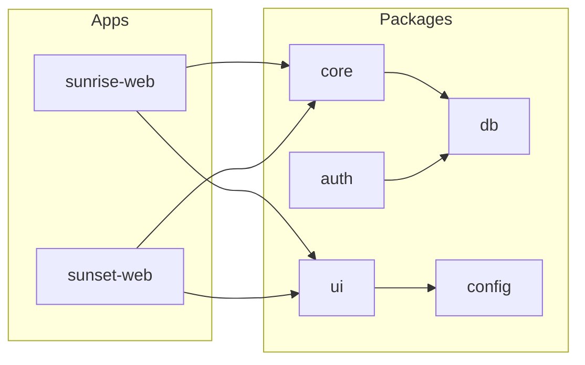

# Turborepo monorepo migration plan

## Ground truth from this repository

- **Stack**: Next.js App Router ([`package.json`](c:\Users\arwin\Desktop\ADPMC\sunrise-2025\package.json)), React 19, Tailwind CSS v4 via `@import "tailwindcss"` and `@theme` in [`app/globals.css`](c:\Users\arwin\Desktop\ADPMC\sunrise-2025\app\globals.css)), ESLint flat config ([`eslint.config.mjs`](c:\Users\arwin\Desktop\ADPMC\sunrise-2025\eslint.config.mjs)).
- **Auth**: NextAuth JWT + Credentials ([`lib/auth.ts`](c:\Users\arwin\Desktop\ADPMC\sunrise-2025\lib\auth.ts)).
- **Database**: **Neon Postgres** via `DATABASE_URL`, accessed today with **`pg` `Pool`** ([`lib/db.ts`](c:\Users\arwin\Desktop\ADPMC\sunrise-2025\lib\db.ts)). Do **not** introduce Prisma unless product explicitly asks; **`packages/db`** centralizes the Neon connection and queries. Optionally adopt **`@neondatabase/serverless`** later for edge/serverless pooling patterns; not required for the migration.
- **Brand coupling**: Many literals for `sunrise-2025.com` and support emails (grep-backed). [`middleware.ts`](c:\Users\arwin\Desktop\ADPMC\sunrise-2025\middleware.ts) allowlists subscription referers to `sunrise-2025.com` or `localhost`; this **must become env-driven** before Sunset shares middleware patterns.
- **Sunset codebase**: Not present in this workspace. Per your direction, **Sunset will be rebuilt** on the upgraded shared stack alongside Sunrise, rather than requiring an immediate dump-in of the old fork.

## Target layout (this repo becomes the monorepo root)

```txt
/
  apps/
    sunrise-web/          # migrated current app
    sunset-web/           # new app: shared packages + memorial-specific routes/features
  packages/
    config/               # env validation, brand registry, feature flags helpers
    shared-types/         # cross-cutting TS types (BrandId, API DTOs as they move)
    ui/                   # primitives + theme-aware components; Tailwind sources
    db/                   # Neon + pg pool, queries/repositories (single schema usage)
    auth/                 # NextAuth options factories, shared session typings (apps wire route handlers)
    billing/              # Stripe/subscription helpers extracted from lib + api routes gradually
    notifications/        # push/slack/telegram orchestration shared pieces
    email/                # nodemailer/templates/Zoho helpers as extracted modules
    core/                 # domain services (events, RSVP, reminders) extracted incrementally
  turbo.json
  pnpm-workspace.yaml
  package.json            # turbo pipelines + workspace scripts
  tsconfig.base.json
```

**Dependency rule (avoid cycles)**: `apps/*` may depend on `packages/*`. Packages must not import from `apps/*`. Lower-level packages (`shared-types`, `config`) must not depend on `ui`. **`db` must not depend on `ui`.**

## Phase 0 — Repository scaffold (no behavior change yet)

1. Add **`pnpm-workspace.yaml`** including `apps/*` and `packages/*`.
2. Add root **`package.json`** with scripts such as `dev`, `build`, `lint` delegating to `turbo run` with `--filter` patterns for each app.
3. Add **[`turbo.json`](https://turbo.build/repo/docs/reference/configuration)** with pipelines:
   - `build`: `dependsOn: ["^build"]`, outputs `.next/**`, `dist/**` as applicable.
   - `lint`: no dependency chain required unless lint depends on types generation later.
   - `dev`: `persistent: true`, `cache: false`.
4. Move the existing Next.js application tree into **`apps/sunrise-web`** (everything that is app-local today: `app/`, `components/`, `lib/`, `public/`, `middleware.ts`, `next.config.ts`, etc.). Keep **one** `next-env.d.ts` per app.
5. Preserve **environment variable names** and `.env.local` workflow per app ([`apps/sunrise-web/.env.local`](c:\Users\arwin\Desktop\ADPMC\sunrise-2025\.env.local) moved or symlinked as you prefer). Document any new shared vars in `packages/config`.

## Phase 1 — TypeScript and tooling hierarchy

1. **`tsconfig.base.json`** at repo root: `strict`, `moduleResolution: "bundler"`, shared `jsx`, `paths` only for workspace packages (e.g. `@repo/ui`, `@repo/db`).
2. **`apps/sunrise-web/tsconfig.json`**: `extends` base; keep **`"@/*": ["./*"]`** so incremental migration does not require rewriting every import on day one.
3. **Packages**: each package gets its own `tsconfig.json`; use **`exports`** in `package.json` for clean public APIs (avoid deep imports that break refactors).
4. **ESLint**: root flat config that references Next’s recommended presets for `apps/*`; packages use a lighter TS-eslint profile. Single **`eslint.config.mjs`** with project references or overrides per workspace folder (match existing [`eslint.config.mjs`](c:\Users\arwin\Desktop\ADPMC\sunrise-2025\eslint.config.mjs) style).
5. **Prettier**: optional single `.prettierrc` at root if not already present; align with team norms.

## Phase 2 — Tailwind v4 monorepo wiring

Sunrise uses Tailwind v4 PostCSS ([`postcss.config.mjs`](c:\Users\arwin\Desktop\ADPMC\sunrise-2025\postcss.config.mjs)). For packages containing components:

- In **`apps/*/app/globals.css`**, after `@import "tailwindcss"`, add **`@source`** directives (Tailwind v4) so classes used inside `packages/ui` are compiled (see [Tailwind v4 monorepo guidance](https://tailwindcss.com/docs/content-configuration)).
- Shared tokens: start by moving the `@theme { ... }` block into **`packages/ui/src/themes/base.css`** (or split brand extensions), then each app imports base + brand layer.

## Phase 3 — `packages/config` and brand model

1. Define **`BrandId = "sunrise" | "sunset"`** in `shared-types`.
2. **`packages/config`** exports a **brand registry**: display name, marketing URLs, default metadata, support emails, motion intensity enum, optional asset paths. Avoid hardcoding domains in middleware or APIs; read from **`NEXT_PUBLIC_SITE_URL`** / **`NEXT_PUBLIC_BRAND`** validated with zod at runtime in server modules.
3. Parameterize [`middleware.ts`](c:\Users\arwin\Desktop\ADPMC\sunrise-2025\middleware.ts) subscription referer allowlist to use **`process.env.NEXT_PUBLIC_SITE_URL`** (parsed hostname) plus optional **`ALLOWED_APP_HOSTS`** comma-separated list for staging/preview.

### Dev and preview-only brand toggle (`IS_SUNSET`)

Goal: toggle Sunrise vs Sunset **locally and on Vercel preview** without touching production behavior.

**Env vars** (document in `packages/config`, example names):

- **`IS_SUNSET`**: server-side flag (`true` / `1` means Sunset).
- **`NEXT_PUBLIC_IS_SUNSET`**: same semantics for client components that need the brand at build/runtime (set both when toggling so server and client stay aligned).

**Production safety (required)**:

- When **`VERCEL_ENV === 'production'`**, **never** honor `IS_SUNSET` or `NEXT_PUBLIC_IS_SUNSET`. Resolve brand only from **deployment intent** (separate Vercel projects for `sunrise-web` vs `sunset-web`, and/or fixed `NEXT_PUBLIC_BRAND` per project). Do not add `IS_SUNSET` to the **production** environment in Vercel; the code path must treat a missing override as normal Sunrise/Sunset per app.
- When **`VERCEL_ENV` is unset** (local) or **`preview`**, allow the override: if `IS_SUNSET` is truthy, treat effective brand as **`sunset`** for theming and config resolution (within the single dev/preview app you are running).

**Implementation sketch** (single helper in `packages/config`, used by `BrandProvider` and server layout):

```ts
export function isSunsetOverrideActive(): boolean {
  if (process.env.VERCEL_ENV === "production") return false
  const v = process.env.IS_SUNSET ?? process.env.NEXT_PUBLIC_IS_SUNSET
  return v === "1" || v === "true"
}
```

Client bundle note: `NEXT_PUBLIC_*` is inlined at build time on Vercel; for **preview** toggling, set matching preview env vars on that deployment. Production deployments omit these variables entirely.

Optional tightening: if you want the override **only** during `next dev` (not `next start` locally), combine with `process.env.NODE_ENV !== "production"`.

**Relationship to two apps**: Long term, `apps/sunrise-web` and `apps/sunset-web` remain the clean separation; the flag is for **short-circuiting** which brand you see while developing or previewing one checkout without switching apps.

## Phase 4 — `BrandProvider` and theme-aware UI

1. Implement **`BrandProvider`** (client) in `packages/ui`: React context holding `brand` and derived tokens (or CSS variable map).
2. Apply **`data-brand="sunrise" | "sunset"`** on `<html>` or a top wrapper in each app’s root layout for purely CSS-driven overrides where helpful.
3. Extract **shadcn-style primitives** from [`components/ui/*`](c:\Users\arwin\Desktop\ADPMC\sunrise-2025\components\ui) into `packages/ui` first (Button, Input, Card, Dialog, etc.) with **no Sunrise-specific copy** inside primitives.
4. Keep **Sunrise-only chrome** (e.g. celebratory hero sections) in `apps/sunrise-web` or `packages/ui/sunrise` only if truly reused; Sunset memorial flows stay in `apps/sunset-web`.



## Phase 5 — `packages/db` (Neon, single schema, multi-brand ready)

1. Move [`lib/db.ts`](c:\Users\arwin\Desktop\ADPMC\sunrise-2025\lib\db.ts) into `packages/db` as the **singleton Pool** factory against **Neon** (still `DATABASE_URL`).
2. Move SQL-heavy modules incrementally into **`packages/db/src/queries/*`** or small **repository** modules; add **`brand` / `event_type` / `tenant_id`** columns only when schema already supports them (no big-bang migration unless Product confirms).
3. Apps import **`@repo/db`**; delete duplicate sunset DB client when Sunset is implemented.

## Phase 6 — `packages/auth`, `billing`, `notifications`, `email`

Order aligned with risk:

1. **`auth`**: Export `createAuthOptions(deps)` factory that accepts db/user lookups from `@repo/db`, keeping NextAuth route handlers thin in `apps/*/app/api/auth/[...nextauth]/route.ts`.
2. **`billing`**: Extract Stripe and subscription helpers from `lib/*` and relevant `app/api/subscription/*` into reusable functions; apps keep HTTP routes but delegate logic.
3. **`email`** / **`notifications`**: Move **`nodemailer`**, templates, Slack/Telegram helpers similarly.

## Phase 7 — `apps/sunset-web` (rebuild alongside Sunrise)

1. Generate a **minimal Next.js App Router shell** that depends on `@repo/ui`, `@repo/config`, `@repo/db` (if needed), with **`BrandProvider` defaulting to `"sunset"`** and Sunset `@theme` tokens (somber palette, reduced motion option).
2. Port **memorial/funeral-specific routes and flows** incrementally; prefer **compose shared dashboards** rather than duplicating entire `app/api` trees. Where APIs are identical, **mount the same route modules** or extract handlers to `packages/core` and re-export.

## Phase 8 — Verification

- **`pnpm dev --filter sunrise-web`** and **`pnpm dev --filter sunset-web`** run independently (different ports via `-p` or env).
- **`turbo run build --filter=...`** for each app.
- Smoke critical paths: login, dashboard, subscription webhook routes, one messaging channel.

## Cursor / AI ergonomics

- Add a root **`AGENTS.md`** (or existing team doc) describing package boundaries, `@repo/*` imports, and “apps thin, packages fat” rules.
- Consistent package scope name: recommend **`@repo/*`** (or `@sunrise/*` if you prefer branding) across all `package.json` files.

## Deliverables checklist (maps to your list)

| Item | Approach |
|------|----------|
| Turborepo + pnpm | Root `turbo.json`, `pnpm-workspace.yaml`, root scripts |
| Move apps | `apps/sunrise-web` now; `apps/sunset-web` scaffold + incremental rebuild |
| TS paths | Base + per-app `@/*`; packages via `exports` |
| Shared Tailwind | v4 `@source` + shared CSS tokens in `packages/ui` |
| ESLint/Prettier | Root flat config with app/package overrides |
| BrandProvider | `packages/ui` + `packages/config` registry |
| Example shared UI | Migrate `components/ui` first |
| Example services | `db` pool + one repository; `auth` factory |
| DB layer | `packages/db`: Neon + `pg` Pool (no Prisma unless later approved) |
| Dev Sunset toggle | `IS_SUNSET` / `NEXT_PUBLIC_IS_SUNSET`; **ignored when `VERCEL_ENV === 'production'`**; omit on Vercel prod |
| Imports | Incremental: new code uses `@repo/*`; allow `@/*` in apps until touched |
| Builds | Turbo pipeline + per-app `next build` |

## Risks and mitigations

- **Large move**: Use one PR that only relocates files + fixes paths, then follow with package extraction PRs.
- **Over-abstraction**: Extract only code that is identical or differs only by brand config; keep Sunset memorial UX in the Sunset app until truly reusable.
- **Domain literals**: Replace **incrementally** with `packages/config` to avoid a giant string-replace blast in one commit.
