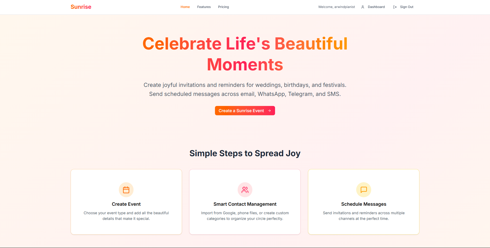

# Sunrise 🌅

**Celebrate Life's Beautiful Moments**

Create joyful invitations and reminders for weddings, birthdays, and festivals. Send scheduled messages across email, WhatsApp, Telegram, and SMS.

**🌐 Website:** [sunrise-2025.com](https://sunrise-2025.com)  
**🚀 Launch Date:** August 1st, 2025

  
   
  <em>Beautiful sunrise-inspired design representing new beginnings and joyful celebrations</em>

## 🖼️ Website Preview

  
   
  <em>Experience our beautiful, user-friendly interface designed for seamless event management</em>

---

## ✨ What is Sunrise?

Sunrise is your all-in-one event management platform that makes celebrating life's special moments effortless and beautiful. Whether you're planning a wedding, birthday party, or festival, Sunrise helps you create stunning invitations and stay connected with your guests.

## 🎉 Key Features

### 🎊 Smart Event Creation
- **Beautiful Templates**: Pre-designed for weddings, birthdays, festivals, and more
- **Custom Branding**: Personalize every detail with your own style
- **Smart Scheduling**: Intelligent date and time management
- **Rich Descriptions**: Add photos, notes, and detailed information

### 👥 Smart Contact Management
- **Flexible Categories**: Organize guests with color-coded categories
- **Multiple Import Options**: 
  - Google Contacts integration (free)
  - vCard (.vcf) file import (free)
  - CSV file import (free)
  - Manual contact addition
- **Shareable Forms**: Let contacts add themselves to your guest list

### 📱 Multi-Channel Messaging
- **Email Campaigns**: Beautiful, trackable email invitations
- **Telegram Messaging**: Instant messaging for tech-savvy guests
- **SMS Notifications**: Reach everyone, even without smartphones
- **Advanced Templates**: Professional designs for every occasion

### ⏰ Automated Scheduling
- **Smart Reminders**: Automated follow-ups and reminders
- **Recurring Events**: Set up regular celebrations
- **Timezone Handling**: Perfect timing for global events
- **Bulk Discounts**: Save tokens on multiple messages

## 💰 Simple, Transparent Pricing

### Token-Based System
Pay only for what you use with our flexible token system:

- **Event Creation**: 1 token per event
- **Email Messages**: 1 token per email
- **Telegram Messages**: 2 tokens per message
- **SMS Notifications**: 3 tokens per SMS

### Subscription Plans

#### 🌟 Basic Plan - $9.90/month
**Perfect for small events and personal use**
- 10% token discount
- 100 lifetime tokens included
- Event scheduling
- Email tracking
- All email templates
- Telegram messaging
- Mobile-friendly interface

#### ⚡ Pro Plan - $29.90/month (Most Popular)
**Best for growing businesses and event planners**
- 20% token discount
- Unlimited tokens
- Advanced email templates
- Telegram messaging
- Priority support
- Custom branding
- Bulk contact import
- More messaging channels

#### 👑 Enterprise Plan - $79.90/month
**For large-scale events and agencies**
- 30% token discount
- Premium email templates
- API access
- Dedicated account manager
- White-label options
- Unlimited everything

### Token Packages
- **Starter Pack**: 25 tokens - Perfect for small events
- **Popular Pack**: 75 tokens - Great for regular users
- **Business Pack**: 150 tokens - Ideal for growing businesses
- **Enterprise Pack**: 500 tokens - For large-scale operations

## 🆓 Start Free Today

- **15 free tokens** to get started
- **Unlimited contacts** - no restrictions
- **Basic templates** included
- **Up to 5 events** on free plan
- **Email support** available

## 🔒 Security & Privacy

- **Bank-level encryption** for all data
- **PDPA compliant** (Malaysia Personal Data Protection Act)
- **Secure authentication** with multiple login options
- **Data export and deletion** rights
- **Privacy-first design**

## 📱 Mobile-Friendly

Access Sunrise from any device with our responsive design. No additional tokens for mobile access - manage your events on the go!

## 🎯 Perfect For

- **Wedding Planners**: Beautiful wedding invitations and guest management
- **Event Organizers**: Professional event coordination
- **Small Businesses**: Customer communication and marketing
- **Personal Celebrations**: Birthday parties, anniversaries, family gatherings
- **Festivals & Events**: Large-scale event management

## 🚀 Getting Started

1. **Visit** [sunrise-2025.com](https://sunrise-2025.com)
2. **Sign up** for your free account
3. **Import contacts** or add them manually
4. **Create your first event** with our beautiful templates
5. **Send invitations** across multiple channels
6. **Track responses** and manage your guest list

## 📞 Support

- **Email**: admin@sunrise-2025.com
- **Help Center**: Available in your dashboard
- **Priority Support**: Available for Pro and Enterprise plans

## 🏢 About Us

**SUNRISE SUNSET SERVICES**  
Business Registration: 202503184225 (CT0152300-K)  
Email: admin@sunrise-2025.com

---

**Launching August 1st, 2025**  
*Making event management simple and joyful* 🌅
